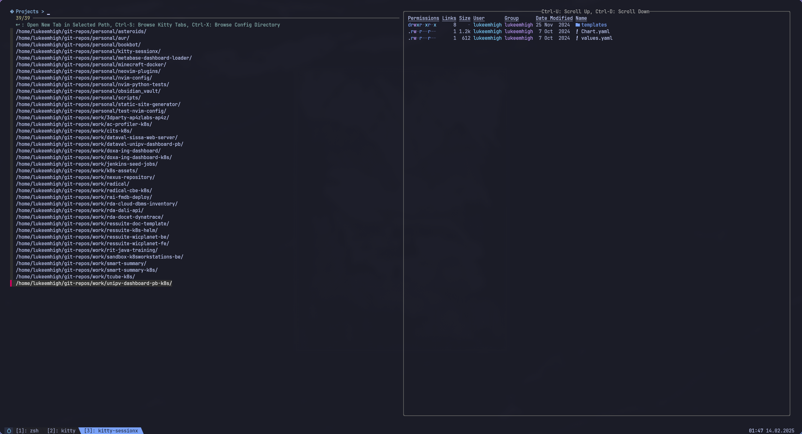

<table>
  <tr>
    <td></td>
    <td></td>
  </tr>
  <tr>
    <td></td>
    <td></td>
  </tr>
</table>
  
<p align="center"><strong style="color: #7aa2f7;">WIP: This project is still pretty much in alpha state.</strong></p>

`kitty-sessionx` is a session manager for [Kitty](https://sw.kovidgoyal.net/kitty/) that leverages `fzf` for managing terminal tabs. It enables you to switch between tabs, launch new ones, rename, and close existing tabs with custom key bindings—making tab management quick and efficient.

## Table of Contents

- [Features](#features)
- [Requirements](#requirements)
- [Installation & Usage](#installation--usage)
- [Key Bindings](#key-bindings)
- [TODO](#todo)

## Features

- **Tab Management:**
  - **Switch Tabs:** Quickly focus on a tab by selecting its title.
  - **Launch New Tabs:** Open new tabs in a specified directory. When a non-matching query is provided, `zoxide` is automatically called to find a matching directory for launching a new session, else a new session will be launched in your `${HOME}`
  - **Rename Tabs:** Easily update the title of active tabs.
  - **Close Tabs:** Remove tabs with a simple key binding.
- **Preview Support:**
  - Preview directory contents with user-defined commands.
  - Preview the contents of kitty tabs.

## Requirements

- [Kitty](https://sw.kovidgoyal.net/kitty/)
- [fzf](https://github.com/junegunn/fzf): used to select and switch between tabs, select directories for new sessions, and more
- [zoxide](https://github.com/ajeetdsouza/zoxide): used to match for directories when a non matching fzf query is provided
- [jq](https://github.com/stedolan/jq): used to parse JSON output from Kitty
- [yq](https://github.com/mikefarah/yq): used to parse YAML configuration file

## Installation & Usage

1. Clone this repository:

   ```sh
   git clone https://github.com/lukeemhigh/kitty-sessionx.git ~/path/to/kitty-sessionx
   ```

2. In your kitty configuration file (`~/.config/kitty/kitty.conf`), bind a key combination to launch `kitty-sessionx`:

   ```
   map kitty_mod+<preferred key> launch --type=overlay ~/path/to/kitty-sessionx/kitty-sessionx.sh
   ```

3. Reload or restart `kitty` to apply the changes.

## Key Bindings

- **Enter:** Execute the selection, switching focus to the chosen tab or launching a new one based on the provided query.
- **Ctrl-R:** Rename the selected tab.
- **Alt-Backspace:** Close the selected tab.
- **Ctrl-X:** Reload to browse configuration directories (defaults to `~/.config`).
- **Ctrl-S:** Refresh/reload the list of active `kitty` tabs.
- **Ctrl-F:** Browse project directories (defaults to `~/workspace`).
- **Ctrl-U / Ctrl-D:** Scroll the preview up or down respectively.

## Configuration

### Configuration Paths

A configuration file named `kitty-sessionx.yml` will be searched in this locations:

- `${XDG_CONFIG_HOME:-${HOME}/.config}/kitty/kitty-sessionx.yml`
- `/kitty-sessionx/script/dir/kitty-sessionx.yml`

If one of this files is found, then default configurations will be overridden with the ones provided in the file.

### Modifying Search Paths

You can modify the paths that are searched when looking for config or project directories by definining custom commands inside your `kitty-sessionx.yml` file, for example:

```yaml
---
reload:
  config: "fd . ~/.dotfiles/**/.config --min-depth 1 --max-depth 1 --type d --type l"
  projects: ...
```

### Modify Fzf Headers/Prompts

If you modified one of the directory being searched, you may also want to modify the header and prompts being shown when reloading fzf to search that path to reflect the change. You can do so by modifying these keys in the config file:

```yaml
---
prompt:
  config: "Your custom prompt here"
  projects: ...
header:
  tabs: "Your custom header here"
  config: ...
  projects: ...
```

### Modify Directory Contents Previewer

You can also modify the command used for directory contents preview, for example:

```yaml
---
preview:
  cmd: "eza --color=always -gH --icons --group-directories-first -lh"
```

### Default configuration:

```yaml
---
reload:
  config: "find ~/.config/** -maxdepth 1 -type d"
  projects: "find ~/workspace/** -mindepth 1 -maxdepth 1 -type d"
prompt:
  config: " Config Files > "
  projects: " Projects > "
header:
  tabs: "󰌑 : Switch to Selected Tab, Ctrl-X: Browse Config Directory, Ctrl-F: Browse Projects, Ctrl-R: Rename Tab, Alt-Backspace: Delete Tab"
  config: "󰌑 : Open New Tab in Selected Path, Ctrl-S: Browse Kitty Tabs, Ctrl-F: Browse Projects"
  projects: "󰌑 : Open New Tab in Selected Path, Ctrl-S: Browse Kitty Tabs, Ctrl-X: Browse Config Directory"
preview:
  cmd: "ls --color=always -lh"
```

## TODO

- [x] External configuration
  - [x] Make file listing command configurable
  - [x] Make search paths for config and projects directories configurable by defining custom commands
  - [x] Make fzf header configurable
  - [ ] Make keybinds configurable
